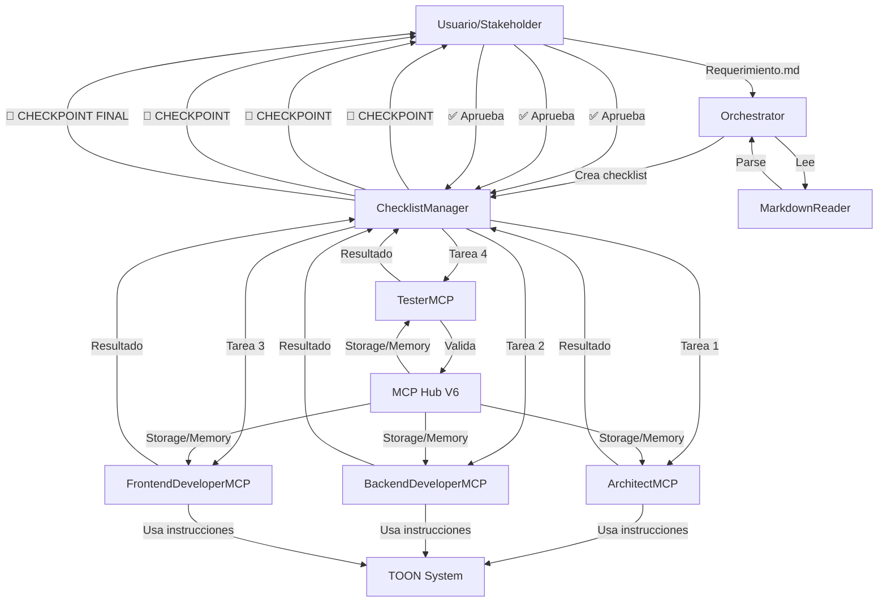

# 🔄 Implementación del Flujo Correcto de Desarrollo

## 📋 Objetivo
Rediseñar el sistema MCP Hub para seguir un flujo de desarrollo real con validación del stakeholder en cada paso, separación de roles por especialidad, y mantenimiento de las instrucciones TOON.

## 🎯 Cambios Principales

### 1. Separación de Roles por Especialidad

#### Roles Actuales → Nuevos Roles
- ❌ **DeveloperMCP** (genérico) → ✅ **BackendDeveloperMCP** + **FrontendDeveloperMCP**
- ✅ **ArchitectMCP** (mantener)
- ✅ **TesterMCP** (mantener)
- ✅ **VisionSpecialistMCP** (mantener)

### 2. Nuevo Flujo con Checkpoints de Validación

```
Usuario → Orquestador
           ↓
       [1] Analiza Requerimientos (Reader Markdown)
           ↓
       [CHECKPOINT 1: Usuario revisa análisis] 🛑
           ↓
       [2] Architect: Crea estructura/tecnologías
           ↓
       [CHECKPOINT 2: Usuario aprueba arquitectura] 🛑
           ↓
       [3] BackendDeveloper: Implementa backend
           ↓
       [CHECKPOINT 3: Usuario valida backend] 🛑
           ↓
       [4] FrontendDeveloper: Implementa frontend
           ↓
       [CHECKPOINT 4: Usuario valida frontend] 🛑
           ↓
       [5] Tester: Valida todo
           ↓
       [CHECKPOINT FINAL: Usuario aprueba proyecto] 🛑
```

### 3. Sistema de Checklist con Aprobación

Cada tarea generará:
- Estado: `pending`, `in_progress`, `waiting_approval`, `approved`, `rejected`
- Comentarios del stakeholder
- Opción de rollback a checkpoint anterior
- Historial de revisiones

## 📁 Estructura de Archivos a Crear/Modificar

### ✅ Archivos TOON Nuevos
- `config/toon/backend_developer.toon`
- `config/toon/frontend_developer.toon`

### ✅ MCPs Nuevos
- `mcps/backend_developer_mcp.py`
- `mcps/frontend_developer_mcp.py`

### ✅ Contratos Nuevos
- `mcps/contracts/backend_developer_contracts.py`
- `mcps/contracts/frontend_developer_contracts.py`

### 🔧 Archivos a Modificar
- `core/orchestrator.py` → Agregar checkpoints de aprobación
- `mcps/contracts/__init__.py` → Exportar nuevos contratos

### 🆕 Componentes Nuevos
- `core/workflow/checklist_manager.py` → Gestión de tareas y aprobaciones
- `core/workflow/checkpoint_handler.py` → Manejo de checkpoints
- `core/workflow/markdown_reader.py` → Lector de requerimientos en markdown

## 🔧 Implementación Paso a Paso

### Paso 1: Crear archivos TOON para roles específicos
1. `backend_developer.toon` - Especializado en APIs, bases de datos, lógica de negocio
2. `frontend_developer.toon` - Especializado en UI/UX, componentes visuales

### Paso 2: Crear contratos Pydantic para nuevos roles
1. `backend_developer_contracts.py` - Input/Output para backend
2. `frontend_developer_contracts.py` - Input/Output para frontend

### Paso 3: Implementar MCPs especializados
1. `BackendDeveloperMCP` - Hereda de `BaseMCP`
2. `FrontendDeveloperMCP` - Hereda de `BaseMCP`

### Paso 4: Crear sistema de Workflow
1. `ChecklistManager` - Gestión de tareas y estados
2. `CheckpointHandler` - Manejo de puntos de aprobación
3. `MarkdownReader` - Parser de requerimientos

### Paso 5: Modificar Orchestrator
1. Integrar `ChecklistManager` y `CheckpointHandler`
2. Agregar método `execute_with_checkpoints()`
3. Implementar flujo interactivo de aprobación

### Paso 6: Crear tests
1. `test_workflow_with_checkpoints.py`
2. `test_backend_developer_mcp.py`
3. `test_frontend_developer_mcp.py`

## 📊 Diagrama del Nuevo Sistema



## ✅ Criterios de Éxito

1. ✅ Cada rol tiene su propio archivo TOON con instrucciones específicas
2. ✅ El orquestador solicita aprobación después de cada tarea
3. ✅ El usuario puede revisar, aprobar, rechazar o solicitar cambios
4. ✅ Los requerimientos se leen desde archivos markdown
5. ✅ Se mantiene la integración con TOON para todas las instrucciones
6. ✅ El sistema permite rollback a checkpoints anteriores
7. ✅ Los tests validan el flujo completo end-to-end

## 🚀 Orden de Ejecución

```bash
# Paso 1: Crear archivos TOON
# → backend_developer.toon
# → frontend_developer.toon

# Paso 2: Crear contratos
# → backend_developer_contracts.py
# → frontend_developer_contracts.py

# Paso 3: Crear MCPs
# → backend_developer_mcp.py
# → frontend_developer_mcp.py

# Paso 4: Crear componentes de workflow
# → markdown_reader.py
# → checklist_manager.py
# → checkpoint_handler.py

# Paso 5: Modificar orchestrator
# → orchestrator.py (agregar checkpoints)

# Paso 6: Tests
# → test_workflow_with_checkpoints.py

# Paso 7: Documentación
# → Actualizar README.md con nuevo flujo
```

## 📝 Notas Importantes

- **CONSERVAR:** Todos los archivos TOON existentes y el PromptManager
- **CONSERVAR:** TokenBudgetManager y toda la capa TOON
- **CONSERVAR:** La capacidad de leer archivos markdown para requerimientos
- **NUEVO:** Separación clara entre backend y frontend developers
- **NUEVO:** Sistema de checkpoints interactivo
- **NUEVO:** Flujo que emula equipo real de desarrollo agile
