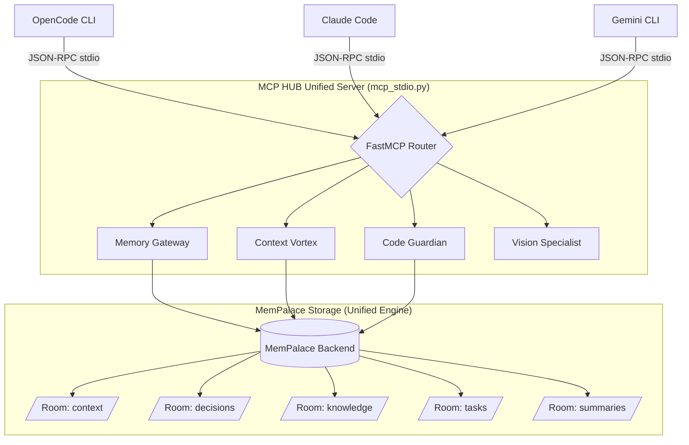

# 🌀 MCP HUB V11 — Unified Context Vortex & Memory Gateway

> **El servidor MCP centralizado definitivo. Un solo punto de entrada (`mcp_stdio.py`) que proporciona más de 40 herramientas para Inteligencia Contextual, Code Guardian, Vision, y Memory Gateway respaldado por MemPalace.**

---

## 🏗️ Arquitectura Unificada (Agnóstica)

El HUB V11 consolida todas las características en un único servidor MCP agnóstico compatible con cualquier cliente (OpenCode, Claude Code, Gemini CLI, Cursor, etc.). Utiliza transporte estándar `stdio` garantizando una comunicación JSON-RPC estable sin interferencias visuales.

### 📊 Diagrama de Arquitectura



---

## 🔄 Flujo de Datos y Ciclo de Vida de la Información

El ciclo de vida de los datos está diseñado para maximizar el rendimiento del LLM minimizando el consumo de tokens mediante compresión y recuperación contextual:

1. **Ingesta (Input):**
   - El agente ejecuta herramientas como `gateway_add_task` o `gateway_add_adr`.
   - Code Guardian indexa código automáticamente (`index_code`).
2. **Persistencia (Storage):**
   - Los datos se almacenan en las "Rooms" de MemPalace.
   - Las relaciones complejas y fragmentos de texto son administrados directamente por el motor unificado de MemPalace, eliminando la necesidad de bases de datos externas fragmentadas o dependencias pesadas como `torch`.
3. **Compresión (Lifecycle Management):**
   - El historial temporal (`/context`) y las sesiones se comprimen incrementalmente mediante `gateway_compress_session` hacia la room `/summaries`.
4. **Recuperación (Output):**
   - En cada iteración de desarrollo, el agente llama a `gateway_build_context`.
   - Esta herramienta recupera tareas activas, el stack del proyecto (`/knowledge`), las decisiones de arquitectura (`/decisions`) y los resúmenes recientes.
   - **Resultado:** En lugar de inyectar 20,000 tokens de historial de chat, el LLM recibe un super-prompt compilado de apenas ~200 tokens con el contexto exacto.

---

## 🛠️ Herramientas Disponibles (Tools)

El HUB expone un arsenal de más de 40 herramientas unificadas, agrupadas en las siguientes capacidades:

### 🌐 Memory Gateway
Herramientas fundamentales para gestionar el ciclo de vida del contexto:
- `gateway_status`: Verifica el estado de la memoria y feature activa.
- `gateway_set_active_feature`: Enfoque de rama de trabajo actual.
- `gateway_add_adr`: Registro persistente de decisiones arquitectónicas.
- `gateway_add_knowledge`: Información estable del stack y guías.
- `gateway_add_task`: Seguimiento de tickets (todo, in_progress, done).
- `gateway_compress_session`: Compresión de contexto en frío.
- `gateway_build_context`: **Context Builder** para inyección óptima en prompts.

### 🛡️ Code Guardian & Context Vortex
- `check_code_creation`: Validaciones estáticas.
- `analyze_project_redundancy`: Prevención de código duplicado.
- `get_code_suggestions` / `learn_from_context`: Mejora continua.
- Herramientas base de MCP: `ping`, `get_context`, `index_status`.

### 👁️ Vision Specialist
- Integración de Playwright asíncrono para toma de screenshots y análisis visual con FastVLM integrado. (Dependencia lazy-loaded para máxima velocidad y evitar errores de startup).

---

## 🚀 Inicio Rápido y Configuración

No es necesario arrancar el servidor manualmente. El cliente MCP (ej. OpenCode) lo inicializa automáticamente cuando es requerido a través de stdio.

### Requisitos
```bash
pip install -r requirements.txt
playwright install chromium
```

### Configuración en Clientes
El HUB debe registrarse en tu cliente apuntando a `mcp_stdio.py`. 

Ejemplo para `opencode.json`:
```json
"memory-gateway": {
    "command": [
        "python",
        "\\HUB\\core\\mcp_stdio.py"
    ],
    "type": "local",
    "enabled": true
}
```

---

## 🧹 Estructura del Proyecto

Se ha eliminado el código redundante y mantenido una arquitectura ultra-limpia:

```text
HUB/
├── core/
│   ├── mcp_stdio.py                 # 🌟 PUNTO DE ENTRADA ÚNICO (Transporte Stdio)
│   ├── mcp_http_server.py           # Engine Principal (FastMCP) y lógica de herramientas
│   ├── mempalace_backend.py         # Conector unificado de MemPalace
│   ├── visual_monitor.py            # Monitor Visual (Apagado preventivamente en stdio)
│   ├── pretty_logger.py             # Logging seguro para consolas (evita corrupción JSON-RPC)
│   ├── advanced_features/           # Componentes de Code Guardian y Vortex
│   ├── vision/                      # Módulo de procesamiento visual
│   ├── memory/                      # Gestión de estados y contexto
│   └── storage/                     # Wrappers de persistencia
├── data/                            # Almacenamiento local de la memoria (ignorado en git)
├── logs/                            # Registros de ejecución
└── tests/                           # Suite de 17 tests unitarios y de integración (100% passing)
```

---
**Versión**: V11.0.0 (Unified Architecture)  
**Estado**: Estable, Unit Tests 100% Passed.
